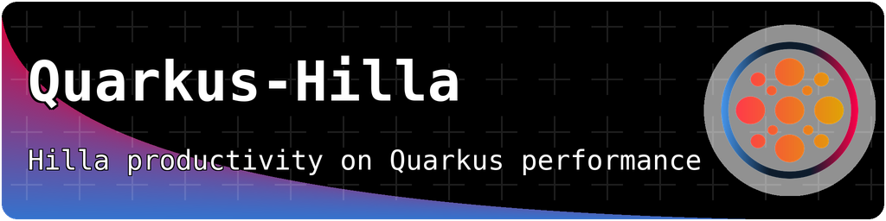

# Quarkus - Hilla

[](https://central.sonatype.com/artifact/com.github.mcollovati/quarkus-hilla)
[](https://central.sonatype.com/artifact/com.github.mcollovati/quarkus-hilla)
[](https://central.sonatype.com/artifact/com.github.mcollovati/quarkus-hilla)
[](https://www.apache.org/licenses/LICENSE-2.0)

A [Quarkus](https://quarkus.io) extension to run [Hilla](https://hilla.dev)
applications on Quarkus.

Hilla is an open source framework, provided by [Vaadin Ltd.](https://vaadin.com),
that integrates a Spring Boot Java backend with a reactive TypeScript frontend.

This extension replaces the Spring Boot backend with Quarkus Context &
Dependency Injection (CDI) and
RESTEasy Reactive for a simpler integration with Quarkus, but preserves the
main features of the Hilla Framework, such
as [Endpoints](https://hilla.dev/docs/lit/guides/endpoints),
[Reactive Endpoints](https://hilla.dev/docs/lit/guides/reactive-endpoints)
and [Security](https://hilla.dev/docs/lit/guides/security).

**NOTE**: This is an **unofficial community extension**, and it is **not**
directly related **nor** supported by Vaadin Ltd.

## Notable changes

### Support for Mutiny Multi return type in @BrowserCallable services  

Starting with 24.7, the extension provides support for [Mutiny](https://smallrye.io/smallrye-mutiny/latest/) `Multi` return type in Hilla endpoints. The `Multi` instance is automatically converted into a `Flux`, that is currently the only reactive type supported by Hilla.
`MutinyEndpointSubscription` can be used as a replacement of Hilla `EndpointSubscription`, when an unsubscribe callback is needed.

```java
@BrowserCallable
@AnonymousAllowed
public class ClockService {

  public Multi<String> getClock() {
    return Multi.createFrom()
            .ticks()
            .startingAfter(Duration.ofSeconds(1))
            .every(Duration.ofSeconds(1))
            .onOverflow().drop()
            .map(unused -> LocalTime.now().toString())
            .onFailure()
            .recoverWithItem(err -> "Sorry, something failed...");
  }

  public MutinyEndpointSubscription<String> getCancellableClock() {
    return MutinyEndpointSubscription.of(getClock(), () -> {
        // unsubscribe callback
    });
  }
}
```

### Experimental Embedded Vaadin Plugin 

Quarkus-Hilla 24.7 introduces an experimental feature that allows to simplify application setup by removing Vaadin Maven (or Gradle) plugin.
The extension has a built-in implementation of the plugin that can be enabled setting `vaadin.build.enabled=true` in `application.properties` or as Java system property.

To make the feature working properly in Maven, you also need to set `quarkus.bootstrap.workspace-discovery=true` in POM `properties` section, or as Java system property.
This is required because when running build, Quarkus Maven plugin does not provide workspace information that are required by Vaadin internals to generate the frontend production bundle.
Hopefully, the behavior may be revisited. If you are interested you can follow the [issue](https://github.com/quarkusio/quarkus/issues/45363) on Quarkus repository.

### Custom Endpoint Prefix  

A custom endpoint prefix can be configured by setting the `vaadin.endpoint.prefix` entry in `application.properties`. The extension will create a custom `connect-client.ts` file in the `frontend` folder and construct the `ConnectClient` object with the configured prefix.
If `connect-client.ts` exists and does not match the default Hilla template, it is not overwritten.

### Integration with Vaadin Quarkus extension  

To provide better support for Hilla on the Quarkus platform and simplify maintenance, the `quarkus-hilla` extension will
depend on the existing [Vaadin Quarkus extension](https://github.com/vaadin/quarkus/), starting with `24.5`. This
integration eliminates the need for code duplication and ensures tighter alignment with Vaadin's ecosystem, offering
more streamlined updates and improved stability. By leveraging the Vaadin Quarkus extension, users of `quarkus-hilla`
will benefit from enhanced compatibility with future Vaadin features.

### Vaadin Unified platform  

Since Vaadin `24.4`, Flow and Hilla are unified in a single platform.
As a consequence, there have been a considerable amount of changes in Hilla, for example the `groupId` of Maven
artifacts
and Java package names moved from `dev.hilla` to `com.vaadin.hilla`.
Quarkus-Hilla will follow the Vaadin platform releases, so the extension version will bump from `2.5` series to `24.4`.
In addition, the minimum supported Quarkus version will be `3.7`.

### Lit and React extensions  

Starting with `2.4.1`, the extension is subdivided into two main artifacts based on the desired front-end framework:

* `quarkus-hilla` for `Lit` based applications
* `quarkus-hilla-react` for `React` based applications

## Limitations

The current Hilla support has some known limitations:

* Vaadin Copilot is not supported
* [Stateless Authentication](https://hilla.dev/docs/lit/guides/security/spring-stateless)
  is not supported
* :warning: :boom: With the Vaadin 24.7, frontend **build fails** because the Hilla endpoint generation tasks relies on the execution of a Spring process. As a temporary workaround you can enable Quarkus-Hilla **Experimental embedded Vaadin plugin implementation**, or you can add the `aot-browser-finder-callable-workaround` dependency to `vaadin-maven-plugin` configuration. The dependency workaround is required only when building for production; in development mode the offending class is automatically replaced by the extension. **The workaround is not required in 24.8** because the generation has been refactored to fallback to the original lookup of endpoints based on internal class finder; in addition Hilla provided a pluggable API to configure endpoint discovery.
  ```xml
                    <plugin>
                        <groupId>com.vaadin</groupId>
                        <artifactId>vaadin-maven-plugin</artifactId>
                        <executions>
                            <execution>
                                <goals>
                                    <goal>prepare-frontend</goal>
                                    <goal>build-frontend</goal>
                                </goals>
                                <phase>compile</phase>
                            </execution>
                        </executions>
                        <dependencies>
                            <dependency>
                                <groupId>com.github.mcollovati</groupId>
                                <artifactId>aot-browser-finder-callable-workaround</artifactId>
                                <version>${quarkus-hilla.version}</version>
                            </dependency>
                        </dependencies>
                    </plugin>
  ```

## Auto CRUD, Auto Grid and Auto Form

Support
for [Auto CRUD](https://hilla.dev/docs/react/components/auto-crud), [Auto Grid](https://hilla.dev/docs/react/components/auto-grid[)
and [Auto Form](https://hilla.dev/docs/react/components/auto-crud) is available in `quarkus-hilla-react`.
However, both extensions provides custom implementations of `CrudRepositoryService` and `ListRepositoryService`,
based on `quarkus-spring-data-jpa` or `quarkus-hibernate-orm-panache` extension.
See the [documentation](https://github.com/mcollovati/quarkus-hilla/wiki/Crud-List-repository-service) for additional
details.

## Endpoints live reload

In dev mode, Quarkus uses a ClassLoader hierarchy that enables the live reload of user code without requiring a rebuild
and restart of the application. However, the reload is usually triggered by a HTTP request, for example a browser page
reload.
To simplify development, `quarkus-hilla` extends Quarkus Live Reload feature to re-generated client side code upon
changes on Hilla endpoint related classes. To trigger live reload, the extension scans for file changes either in source
code or compiled classes folders (e.g. `src/main/java` or `target/classes` in a Maven project).
The default strategy is to watch for class files, but it can be changed with the
`vaadin.hilla.live-reload.watch-strategy`
property.
Endpoints live reload is disabled by default, but can be activated setting the `vaadin.hilla.live-reload.enable`
property to `true` in the `application.properties` file.
To prevent excessive reloads, the watched folders can be restricted by providing a list of relative paths with the
`vaadin.hilla.live-reload.watched-paths` property.
The Endpoints live reload feature works better if `quarkus.live-reload.instrumentation` is set to true, since this
setting allows Quarkus to potentially redefine classes at runtime without triggering a server restart.

Below, there's an example configuration, for an application that stored Hilla related classes in
`src/main/java/com/example/ui` folder.

```
quarkus.live-reload.instrumentation=true
vaadin.hilla.live-reload.enable=true
vaadin.hilla.live-reload.watch-strategy=source
vaadin.hilla.live-reload.watched-paths=com/example/ui
```

**NOTE**: currently source file watch strategy supports only Java file, not Kotlin. This is because the watcher inspects
the source code to detect all declared type, but the parser currently works only for Java source files.

## Usage statistics

As discussed in this Hilla [ticket](https://github.com/vaadin/hilla/issues/211),
the extension report itself to the Vaadin usage statistics mechanism in order to
get a better understanding of how widely the extension is used compared to Hilla
usage in general.
The hope is that, based on this data, Vaadin may consider in the future to provide
an official extension.
Statistic are collected only in development mode and no sensitive data is
gathered.
For instructions on how to opt-out, see
the [client-side collector repository](https://github.com/vaadin/vaadin-usage-statistics#opting-out).

## Getting started

Get started with `quarkus-hilla` by following the [Quick Start Guide](../../wiki/QuickStart)
or download the [starter project](https://github.com/mcollovati/quarkus-hilla-starter).

```xml

<dependency>
    <groupId>com.github.mcollovati</groupId>
    <artifactId>quarkus-hilla</artifactId>
    <version>24.9.x</version>
</dependency>
```

or

```xml

<dependency>
    <groupId>com.github.mcollovati</groupId>
    <artifactId>quarkus-hilla-react</artifactId>
    <version>24.9.x</version>
</dependency>
```

## Releases

|                                                                                                  Quarkus-Hilla / Hilla                                                                                                   |                                                                               Quarkus                                                                               |                                                                              Vaadin                                                                              |
|:------------------------------------------------------------------------------------------------------------------------------------------------------------------------------------------------------------------------:|:-------------------------------------------------------------------------------------------------------------------------------------------------------------------:|:----------------------------------------------------------------------------------------------------------------------------------------------------------------:|
| <picture></picture> | <picture></picture> |   <picture></picture>   |
| <picture></picture> | <picture></picture> |   <picture></picture>   |
|  <picture></picture>  |  <picture></picture>  |   <picture></picture>   |
|   <picture></picture>   | <picture></picture> | <picture></picture> |

**NOTE**: The major and minor version of Quarkus-Hilla always matches the Vaadin/Hilla version.

## Development

<picture></picture>
<picture></picture>
<picture></picture>

## Build and test

To build the extension locally you need to install JDK 17 or later and Maven 3.8 or later.

The extension and its required dependencies can be built by typing the following command:

```terminal
mvn -DskipTests install
```

To run the test suite, execute the maven `verify` goal:

```terminal
mvn -DtrimStackTrace=false verify
```

End-to-end test modules can be found in the `integration-tests` folder.
Integration tests use [Selenide](https://selenide.org/) for browser interaction,
the browser used by default is Chrome, except for MacOS, where Safari is used.
Execution of end-to-end integration tests requires the activation of the maven `it-tests` profile.

```terminal
mvn -DtrimStackTrace=false -Pit-tests verify
```

The same tests can also be executed in production mode, by activating the `production` profile in addition
to `it-tests`.

```terminal
mvn -DtrimStackTrace=false -Pit-tests,production verify
```

Tests run by default in headless mode, meaning that the browser window will not be visible during the execution,
unless a debugger is attached to the JVM, either by running the tests in debug mode from the IDE, or by providing the
`-Dmaven.surefire.debug` system property to the maven command line.

```terminal
mvn -DtrimStackTrace=false -Dmaven.surefire.debug -Pit-tests verify
```

## Update codestarts

The source code of the extension codestarts are built by downloading a project from start.vaadin.com and applying necessary updates and cleanup.
To update the source code, run the following command in the `lit/runtime` and `react/runtime` folders.

```terminal
mvn -Pupdate-hilla-codestart
```

Once the codestarts are updated, run the `integration-tests/codestart-tests` test modules, using the `-Dsnap` option to update the snapshot files.
```terminal
mvn clean verify -Dsnap
```

The tests generate projects into the `target` folder, that can be used for manual verifications.
Once verifications are completed, commit the changes.

## Release

The release process is based on the awesome [JReleaser](https://jreleaser.org/) tool.

To perform a manual release type the following commands.
Version must be in format N.N.N, for example `1.0.0`.
Pre-releases can use `-alpha`, `-beta` and `-rc` suffix, followed by a number,
for example `1.0.0-beta2`.

Environment variables required by the release process:

* JRELEASER_GITHUB_TOKEN: to create release on GitHub
* JRELEASER_GPG_PUBLIC_KEY, JRELEASER_GPG_SECRET_KEY and
  JRELEASER_GPG_PASSPHRASE: to sign artifacts
* JRELEASER_NEXUS2_MAVEN_CENTRAL_USERNAME and
  JRELEASER_NEXUS2_MAVEN_CENTRAL_PASSWORD: to publish on maven central

Use `-Djreleaser.dry.run=true` flag to test the release without publishing
artifacts.

```terminal
mvn clean
mvn -Pdistribution -Drevision=<version-to-release> -DskipTests -DaltDeploymentRepository=local::file:./target/staging-deploy deploy
mvn -N -Pdistribution -Drevision=<version-to-release> jreleaser:full-release
```

## Contributors ✨

Thanks goes to these wonderful
people ([emoji key](https://allcontributors.org/docs/en/emoji-key)):

<!-- ALL-CONTRIBUTORS-LIST:START - Do not remove or modify this section -->
<!-- prettier-ignore-start -->
<!-- markdownlint-disable -->
<table>
  <tbody>
    <tr>
      <td align="center" valign="top" width="14.28%"><a href="https://github.com/mcollovati"><br /><sub><b>Marco Collovati</b></sub></a><br /><a href="https://github.com/mcollovati/quarkus-hilla/commits?author=mcollovati" title="Code">💻</a> <a href="#maintenance-mcollovati" title="Maintenance">🚧</a></td>
      <td align="center" valign="top" width="14.28%"><a href="https://github.com/Dudeplayz"><br /><sub><b>Dario Götze</b></sub></a><br /><a href="https://github.com/mcollovati/quarkus-hilla/commits?author=Dudeplayz" title="Code">💻</a> <a href="#maintenance-Dudeplayz" title="Maintenance">🚧</a></td>
    </tr>
  </tbody>
</table>

<!-- markdownlint-restore -->
<!-- prettier-ignore-end -->

<!-- ALL-CONTRIBUTORS-LIST:END -->

This project follows
the [all-contributors](https://github.com/all-contributors/all-contributors)
specification. Contributions of any kind are welcome!

### Credits

The banner for this project was created using the awesome [Banner Maker](https://github.com/obarlik/banner-maker) by [@obarlik](https://github.com/obarlik).
