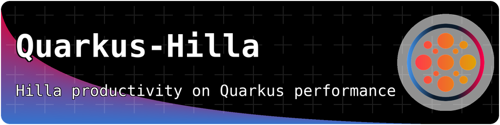

<p align="center">
  
</p>

<h2 align="center">
A <a href="https://quarkus.io">Quarkus</a> extension to run <a href="https://vaadin.com/hilla">Hilla</a> applications on Quarkus
</h2>

<p align="center">
  <strong>Build modern full-stack Java applications with reactive TypeScript frontends powered by Quarkus</strong>
</p>

<p align="center">
  <a href="https://central.sonatype.com/artifact/com.github.mcollovati/quarkus-hilla"></a>
  <a href="https://www.apache.org/licenses/LICENSE-2.0"></a>
</p>

<p align="center">
  <a href="#-quick-start">🚀 Quick Start</a> &nbsp; • &nbsp;
  <a href="#-feature-overview">💎 Features</a> &nbsp; • &nbsp;
  <a href="#-compatibility-matrix">📦 Compatibility</a> &nbsp; • &nbsp;
  <a href="#%EF%B8%8F-configuration">⚙️ Configuration</a> &nbsp; • &nbsp;
  <a href="#-documentation">📚 Documentation</a>
</p>

---

## 📖 About

Hilla is an open source framework, provided by [Vaadin Ltd.](https://vaadin.com), that integrates a Spring Boot Java backend with a reactive TypeScript frontend.

**Quarkus-Hilla** replaces the Spring Boot backend with **Quarkus Context & Dependency Injection (CDI)** and **RESTEasy Reactive** for a simpler integration with Quarkus, while preserving the main features of the Hilla Framework, such as [Endpoints](https://vaadin.com/docs/latest/hilla/guides/endpoints), [Reactive Endpoints](https://vaadin.com/docs/latest/hilla/guides/reactive-endpoints), and [Security](https://vaadin.com/docs/latest/hilla/guides/security).

It is also currently the **only Quarkus integration with Vaadin Copilot support** — the official Flow-only [Vaadin Quarkus extension](https://github.com/vaadin/quarkus/) doesn't offer it yet.

> [!NOTE]
> This is an **unofficial community extension**, and it is **neither** directly related to **nor** supported by Vaadin Ltd.

---

## 💎 Feature Overview

- ✨ **[Vaadin Copilot Integration](docs/features.md#vaadin-copilot-integration)** _(since 25.1.2 — Quarkus-Hilla exclusive)_
- 🖥️ [Quarkus Dev UI Integration](docs/features.md#quarkus-dev-ui-integration)
- 🏗️ [Auto CRUD, Auto Grid and Auto Form](docs/features.md#auto-crud-auto-grid-and-auto-form) _(React UI, Lit / React services)_
- 🔄 [Endpoints Live Reload](docs/features.md#endpoints-live-reload)
- ⚡ [Mutiny Multi Support](docs/features.md#mutiny-multi-support)
- 🚀 [Native Image Support](docs/features.md#native-image-support)
- 🎯 [Custom Endpoint Prefix](docs/features.md#custom-endpoint-prefix)
- 🔌 [Vaadin Quarkus Alignment](docs/features.md#vaadin-quarkus-alignment)
- 📦 [Production builds via the official Vaadin Quarkus extension](https://vaadin.com/docs/latest/flow/integrations/quarkus#production-mode)

> [!WARNING]
> Known limitations:
> - Vaadin Copilot support does not include JPA/Data helpers, Spring Security user switching, or full JVM hotswap integration
> - [Stateless Authentication](https://vaadin.com/docs/latest/hilla/guides/security/spring-stateless) is not supported

---

## 🚀 Quick Start

> [!IMPORTANT]
> **On v24 or older?** This README targets v25. Go to the [v24 Docs](docs/v24-docs.md) for legacy setup, or the [v24 → v25 Migration Guide](docs/migration-v24-to-v25.md) if you're upgrading.

> [!TIP]
> - 📘 [Quick Start Guide](../../wiki/QuickStart) — Detailed setup instructions
> - 🎬 [Starter Project](https://github.com/mcollovati/quarkus-hilla-starter) — Download and start coding immediately
> - ⚙️ [Configuration Reference](docs/configuration.md) — All configuration options

### Setup

Choose your frontend framework:

**React** (recommended):
```xml
<dependency>
    <groupId>com.github.mcollovati</groupId>
    <artifactId>quarkus-hilla-react</artifactId>
    <version>25.2.x</version>
</dependency>
```

**Lit**:
```xml
<dependency>
    <groupId>com.github.mcollovati</groupId>
    <artifactId>quarkus-hilla</artifactId>
    <version>25.2.x</version>
</dependency>
```

> [!NOTE]
> Hilla prioritizes React, so new features are typically available first or exclusively for React.

### Create Your First Endpoint

```java
@BrowserCallable
@AnonymousAllowed
public class GreetingService {

    public String greet(String name) {
        return "Hello, " + name + "!";
    }
}
```

That's it! The TypeScript client is automatically generated and type-safe.

---

## 📦 Compatibility Matrix

Each row applies from its Quarkus-Hilla version up to the next row above it.

|                                                                                          Quarkus-Hilla                                                                                          |                                                             Quarkus                                                              |                                                          Vaadin / Hilla                                                          |
|:-------------------------------------------------------------------------------------------------------------------------------------------------------------------------------------------------:|:---------------------------------------------------------------------------------------------------------------------------------:|:---------------------------------------------------------------------------------------------------------------------------------:|
| <picture></picture> | <picture></picture> | <picture></picture> |
| <picture></picture> | <picture></picture> | <picture></picture> |
| <picture></picture> | <picture></picture> | <picture></picture> |
| <picture></picture> | <picture></picture> | <picture></picture> |
| <picture></picture> | <picture></picture> | <picture></picture> |
| <picture></picture>     | <picture></picture> | <picture></picture> |
| <picture></picture>        | <picture></picture>   | <picture></picture> |
| <picture></picture>          | <picture></picture> | <picture></picture> |

> [!NOTE]
> Quarkus-Hilla's major/minor version matches Vaadin/Hilla, but the Quarkus baseline can shift within a line — e.g. Vaadin `25.0.9` raised the [Vaadin Quarkus extension](https://github.com/vaadin/quarkus/) baseline from `3.27` to `3.32` after Flow moved to Jackson `3.1.x`, which is why Quarkus-Hilla `25.0.2` needs the newer Quarkus.
>
> On v24 or older? See [v24 Docs](docs/v24-docs.md) for setup notes and workarounds.

---

## ⚙️ Configuration

All settings are set in `application.properties`. See the [Configuration Reference](docs/configuration.md):

- 🔄 [Live Reload](docs/configuration.md#live-reload)
- 🎯 [Endpoints](docs/configuration.md#endpoints)
- 🔒 [Security](docs/configuration.md#security)
- ✨ [Copilot](docs/configuration.md#copilot)
- 🏗️ [Vaadin Build](docs/configuration.md#vaadin-build)

---

## 📚 Documentation

**Guides**

- 📖 [Wiki Documentation](../../wiki)
- 💎 [Feature Details](docs/features.md)
- ⚙️ [Configuration Reference](docs/configuration.md)
- ✨ [Vaadin Copilot Integration](docs/copilot-integration.md)
- 🔧 [CRUD & Repository Services](../../wiki/Crud-List-repository-service)
- ⬆️ [v24 → v25 Migration Guide](docs/migration-v24-to-v25.md)
- 🗃️ [v24 Docs](docs/v24-docs.md) — setup notes and workarounds for v24 and older

**External**

- 📘 [Hilla Official Docs](https://vaadin.com/docs/latest/hilla)
- 🚀 [Quarkus Guides](https://quarkus.io/guides/)

**Maintainer**

- 🛠️ [Build and Test](docs/build-and-test.md)
- 🚢 [Release Process](docs/release-process.md)
- 🧬 [Update Codestarts](docs/update-codestarts.md)
- 🔢 [Bump Project Version](docs/bump-project-version.md)

---

## 📊 Usage Statistics

The extension reports itself to Vaadin's usage statistics mechanism (see [Hilla issue #211](https://github.com/vaadin/hilla/issues/211)) to help demonstrate adoption and encourage official support from Vaadin.

- 📈 Statistics are collected **only during development mode**
- 🔒 **No sensitive data** is collected
- 🚫 [How to opt out](https://github.com/vaadin/vaadin-usage-statistics#opting-out)

---

## 🤝 Contributors

Thanks goes to these wonderful people ([emoji key](https://allcontributors.org/docs/en/emoji-key)):

<!-- ALL-CONTRIBUTORS-LIST:START - Do not remove or modify this section -->
<!-- prettier-ignore-start -->
<!-- markdownlint-disable -->
<table>
  <tbody>
    <tr>
      <td align="center" valign="top" width="14.28%"><a href="https://github.com/mcollovati"><br /><sub><b>Marco Collovati</b></sub></a><br /><a href="https://github.com/mcollovati/quarkus-hilla/commits?author=mcollovati" title="Code">💻</a> <a href="#maintenance-mcollovati" title="Maintenance">🚧</a></td>
      <td align="center" valign="top" width="14.28%"><a href="https://github.com/Dudeplayz"><br /><sub><b>Dario Götze</b></sub></a><br /><a href="https://github.com/mcollovati/quarkus-hilla/commits?author=Dudeplayz" title="Code">💻</a> <a href="#maintenance-Dudeplayz" title="Maintenance">🚧</a></td>
    </tr>
  </tbody>
</table>
<!-- markdownlint-restore -->
<!-- prettier-ignore-end -->

<!-- ALL-CONTRIBUTORS-LIST:END -->

This project follows the [all-contributors](https://github.com/all-contributors/all-contributors) specification. Contributions of any kind are welcome!

---

## 🙏 Credits

The banner for this project was created using the awesome [Banner Maker](https://github.com/obarlik/banner-maker) by [@obarlik](https://github.com/obarlik).
