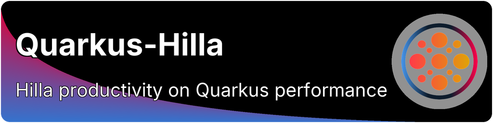
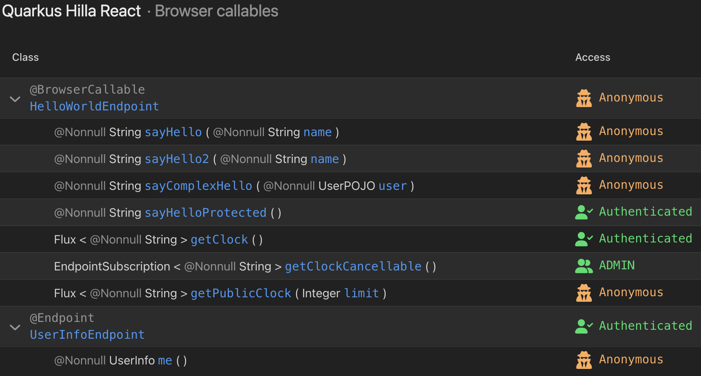

<p align="center">
  
</p>

<h2 align="center">
A <a href="https://quarkus.io">Quarkus</a> extension to run <a href="https://vaadin.com/hilla">Hilla</a> applications on Quarkus
</h2>

<p align="center">
  <strong>Build modern full-stack Java applications with reactive TypeScript frontends powered by Quarkus</strong>
</p>

<p align="center">
  <a href="https://central.sonatype.com/artifact/com.github.mcollovati/quarkus-hilla"></a>
  <a href="https://central.sonatype.com/artifact/com.github.mcollovati/quarkus-hilla"></a>
  <a href="https://central.sonatype.com/artifact/com.github.mcollovati/quarkus-hilla"></a>
  <a href="https://www.apache.org/licenses/LICENSE-2.0"></a>
</p>

<p align="center">
  <a href="#-quick-start">🚀 Quick Start</a> &nbsp; • &nbsp;
  <a href="#-exclusive-quarkus-hilla-features">✨ Features</a> &nbsp; • &nbsp;
  <a href="#-documentation">📚 Documentation</a> &nbsp; • &nbsp;
  <a href="#%EF%B8%8F-configuration-reference">⚙️️ Configuration</a> &nbsp; • &nbsp;
  <a href="#-current-releases">📦 Releases</a> &nbsp; • &nbsp;
  <a href="#-development-version">🔧 Development</a>
</p>

---

## 📖 About

Hilla is an open source framework, provided by [Vaadin Ltd.](https://vaadin.com), that integrates a Spring Boot Java backend with a reactive TypeScript frontend.

**Quarkus-Hilla** replaces the Spring Boot backend with **Quarkus Context & Dependency Injection (CDI)** and **RESTEasy Reactive** for a simpler integration with Quarkus, while preserving the main features of the Hilla Framework, such as [Endpoints](https://vaadin.com/docs/latest/hilla/guides/endpoints), [Reactive Endpoints](https://vaadin.com/docs/latest/hilla/guides/reactive-endpoints), and [Security](https://vaadin.com/docs/latest/hilla/guides/security).

> [!NOTE]
> This is an **unofficial community extension**, and it is **neither** directly related to **nor** supported by Vaadin Ltd.

---

## 🌟 Exclusive Quarkus-Hilla Features

- 🎯 **Type-Safe Communication** - Automatically generated TypeScript types from Java endpoints
- ⚡ **Reactive Streaming** - Support for Mutiny `Multi` and reactive endpoints
- 🔒 **Security Integration** - Built-in support for authentication and authorization
- 🔄 **Hot Reload** - Endpoints live reload in development mode
- 🖥️ **Dev UI Integration** - Visualize endpoint security constraints and null-safety in Quarkus Dev UI (since 24.7)
- 🏗️ **Auto CRUD** - Automatic CRUD operations with Auto Grid and Auto Form (React)
- 🚀 **Native Image** - Full GraalVM native image support (since 24.5)
- 🎨 **Framework Choice** - Support for both Lit and React frontends
- 🔌 **Panache Integration** - Custom repository services for Hibernate ORM Panache
- 📦 **Embedded Build-Plugin** - Built-in Vaadin Maven plugin (24.7-24.9, integrated into official Vaadin extension in 25.0+)

---

## 🚀 Quick Start

> [!TIP]
> - 📘 [Quick Start Guide](../../wiki/QuickStart) — Detailed setup instructions
> - 🎬 [Starter Project](https://github.com/mcollovati/quarkus-hilla-starter) — Download and start coding immediately
> - ⚙️ [Configuration Reference](#%EF%B8%8F-configuration-reference) — Learn about configuration options

### Setup

Choose your frontend framework:

**For React (recommended) applications:**
```xml
<dependency>
    <groupId>com.github.mcollovati</groupId>
    <artifactId>quarkus-hilla-react</artifactId>
    <version>24.9.x</version>
</dependency>
```

**For Lit applications:**
```xml
<dependency>
    <groupId>com.github.mcollovati</groupId>
    <artifactId>quarkus-hilla</artifactId>
    <version>24.9.x</version>
</dependency>
```

> [!NOTE]
> Hilla prioritizes React, so new features are typically available first or exclusively for React.

> [!CAUTION]
> **Vaadin 24.7** requires a workaround for frontend builds. See the **24.7 Build Workaround** in the [Limitations](#️-current-limitations) section for details.

### Create Your First Endpoint

```java
@BrowserCallable
@AnonymousAllowed
public class GreetingService {

    public String greet(String name) {
        return "Hello, " + name + "!";
    }
}
```

That's it! The TypeScript client is automatically generated and type-safe.

---

## 📚 Documentation

- 📖 [Wiki Documentation](../../wiki)
- 🔧 [CRUD & Repository Services](../../wiki/Crud-List-repository-service)
- 📘 [Hilla Official Docs](https://vaadin.com/docs/latest/hilla)
- 🚀 [Quarkus Guides](https://quarkus.io/guides/)

---

## 🎯 Features & Highlights

### Quarkus Dev UI Integration 

The extension provides a dedicated Dev UI page to help you understand and debug your Hilla endpoints during development.

<picture>
  <source media="(prefers-color-scheme: dark)" srcset="etc/dev-ui-dark.png">
  <source media="(prefers-color-scheme: light)" srcset="etc/dev-ui-light.png">
  
</picture>

**Key Features:**
- **Security Visualization** - See the actual security constraints applied to each server-side endpoint, including roles and authentication requirements
- **Null-Safety Overview** - All `@NonNull` types are highlighted, showing their null-safety status at a glance
- **Endpoint Overview** - Complete list of all browser-callable endpoints with their methods and parameters

> [!TIP]
> Access the Dev UI by running your application in dev mode (`mvn quarkus:dev`) and navigating to `http://localhost:8080/q/dev-ui`

### Mutiny Multi Support 

Support for [Mutiny](https://smallrye.io/smallrye-mutiny/latest/) `Multi` return type in Hilla endpoints. The `Multi` instance is automatically converted into a `Flux`, which is currently the only reactive type supported by Hilla.
`MutinyEndpointSubscription` can be used as a replacement for Hilla `EndpointSubscription`, when an unsubscribe callback is needed.

```java
@BrowserCallable
@AnonymousAllowed
public class ClockService {

    public Multi<String> getClock() {
        return Multi.createFrom()
                .ticks()
                .startingAfter(Duration.ofSeconds(1))
                .every(Duration.ofSeconds(1))
                .onOverflow().drop()
                .map(unused -> LocalTime.now().toString())
                .onFailure()
                .recoverWithItem(err -> "Sorry, something failed...");
    }

    public MutinyEndpointSubscription<String> getCancellableClock() {
        return MutinyEndpointSubscription.of(getClock(), () -> {
            // unsubscribe callback
        });
    }
}
```

### Experimental Embedded Vaadin Plugin 

Simplify application setup by entirely removing the Vaadin Maven (or Gradle) plugin. The extension provides a built-in implementation that can be enabled by setting `vaadin.build.enabled=true` in `application.properties`.

> [!IMPORTANT]
> **As of Vaadin 25.0**, this experimental feature has been integrated into the official [Vaadin Quarkus extension](https://github.com/vaadin/quarkus/) via [PR #215](https://github.com/vaadin/quarkus/pull/215). Applications using Vaadin 25.0+ benefit from this functionality natively through the official extension, without requiring any Quarkus-Hilla specific configuration or the `quarkus.bootstrap.workspace-discovery` workaround.

**Setup for Vaadin 25.0+:**

Simply enable the embedded build plugin in your configuration:

```properties
# In application.properties
vaadin.build.enabled=true
```

That's it! No additional workarounds needed.

---

**Setup for Vaadin 24.7-24.9:**

Enable the embedded build plugin and add the required workaround:

```properties
# In application.properties
vaadin.build.enabled=true
```

```xml
<!-- In pom.xml properties section -->
<quarkus.bootstrap.workspace-discovery>true</quarkus.bootstrap.workspace-discovery>
```

> [!WARNING]
> The `quarkus.bootstrap.workspace-discovery` property is required for versions 24.7-24.9 because the Quarkus Maven plugin does not provide workspace information needed by Vaadin internals. See [Quarkus Issue #45363](https://github.com/quarkusio/quarkus/issues/45363) for details.

### Custom Endpoint Prefix 

Configure a custom endpoint prefix via `vaadin.endpoint.prefix` in `application.properties`. The extension automatically creates a custom `connect-client.ts` file in the frontend folder and constructs the `ConnectClient` object with the configured prefix.

```properties
vaadin.endpoint.prefix=/new-prefix
```

> [!IMPORTANT]
> If `connect-client.ts` exists and does not match the default Hilla template, it is not overwritten.

### Endpoints Live Reload 

In dev mode, the extension automatically regenerates client-side code when endpoint classes change, eliminating the need for a full rebuild.

Quarkus-Hilla extends Quarkus Live Reload to automatically regenerate client-side code when Hilla endpoint-related classes change. The extension monitors file changes in either source code or compiled class folders and triggers the TypeScript client regeneration accordingly.

<details>
<summary><strong>🔍 Implementation Details</strong></summary>

**How it works:**

Quarkus uses a ClassLoader hierarchy that enables live reload of user code without requiring a rebuild and restart. However, reload is typically triggered by an HTTP request (e.g., browser page reload).

Quarkus-Hilla extends this mechanism by:
1. **Scanning for changes** in configured folders (source or compiled classes)
2. **Detecting endpoint-related modifications** in Hilla endpoint classes
3. **Triggering automatic regeneration** of TypeScript client code
4. **Notifying the browser** to reload the updated code

**Watch Strategies:**

- **CLASS (default)**: Monitors compiled class files in `target/classes` (Maven) or `build/classes` (Gradle)
    - ✅ Works with both Java and Kotlin
    - ✅ More reliable when used with `quarkus.live-reload.instrumentation=true`

- **SOURCE**: Monitors source files in `src/main/java`
    - ⚠️ Currently only supports Java files
    - ⚠️ Kotlin files are not detected

**Restricting Watched Paths:**

To prevent excessive reloads, specify only the folders containing Hilla endpoints:

```properties
# Watch only endpoint-related packages
vaadin.hilla.live-reload.watched-paths=com/example/endpoints,com/example/services
```

Paths are relative to the source/class root directory.

</details>

**Configuration Example:**
```properties
quarkus.live-reload.instrumentation=true
vaadin.hilla.live-reload.enable=true
vaadin.hilla.live-reload.watch-strategy=source
vaadin.hilla.live-reload.watched-paths=com/example/ui
```

**Configuration Options:**
- `vaadin.hilla.live-reload.enable` - Enable/disable live reload (default: `false`)
- `vaadin.hilla.live-reload.watch-strategy` - Watch `source` files or compiled `class` files (default: `class`)
- `vaadin.hilla.live-reload.watched-paths` - Restrict watched folders (relative paths, comma-separated)

> [!TIP]
> Setting `quarkus.live-reload.instrumentation=true` allows Quarkus to potentially redefine classes at runtime without triggering a server restart, which works better with Endpoints Live Reload.

> [!NOTE]
> Source file watching currently supports only Java files, not Kotlin.

### Native Image Support 

Full GraalVM native image generation support without any known limitations.

### Vaadin Quarkus Integration 

Starting with version 24.5, `quarkus-hilla` depends on the existing [Vaadin Quarkus extension](https://github.com/vaadin/quarkus/), eliminating code duplication and ensuring closer alignment with Vaadin's ecosystem.

### Auto CRUD, Auto Grid and Auto Form 

The [Auto CRUD](https://vaadin.com/docs/latest/components/auto-crud), [Auto Grid](https://vaadin.com/docs/latest/components/auto-grid), and [Auto Form](https://vaadin.com/docs/latest/components/auto-crud) components are available in `quarkus-hilla-react`.

The extension provides custom implementations of `CrudRepositoryService` and `ListRepositoryService` for both **Lit** and **React** applications, based on:
- `quarkus-spring-data-jpa`
- `quarkus-hibernate-orm-panache`

> [!TIP]
> Check the [documentation](../../wiki/Crud-List-repository-service) for details.

> [!IMPORTANT]
> The Auto CRUD, Auto Grid, and Auto Form **components** are only available for React. However, the `CrudRepositoryService` and `ListRepositoryService` can be used in Lit applications as well.

<details>
<summary><strong>📜 Older Changes (24.4 and earlier)</strong></summary>

### Vaadin Unified Platform 

Since Vaadin 24.4, Flow and Hilla are unified in a single platform. The extension version now follows Vaadin platform releases (24.x instead of 2.x).

**Breaking Changes:**
- Hilla's Maven groupId changed from `dev.hilla` to `com.vaadin.hilla`
- Java package names updated accordingly
- Minimum Quarkus version: 3.7+

### Lit and React Extensions 

Starting with 2.4.1, the extension is subdivided into two artifacts based on the desired front-end framework:
- `quarkus-hilla` for **Lit** based applications
- `quarkus-hilla-react` for **React** based applications

</details>

---

## ⚠️ Current Limitations

The current Hilla support has some known limitations that we aim to address in future releases.

- ❌ Vaadin Copilot is not supported
- ❌ [Stateless Authentication](https://vaadin.com/docs/latest/hilla/guides/security/spring-stateless) is not supported

<details>
<summary><strong>⚠️ Vaadin 24.7 Build Workaround (Not required in 24.8+)</strong></summary>

With Vaadin 24.7, the frontend build fails because the Hilla endpoint generation tasks depend on the execution of a Spring process.

> **NOTE:** The dependency workaround is **only required for production builds**. In development mode, the offending class is automatically replaced by the extension.

> **CAUTION:** This workaround is **not required in 24.8+** because:
> - The generation has been refactored to fall back to the original lookup of endpoints based on internal class finder
> - Hilla now provides a pluggable API to configure endpoint discovery

**Workaround Options:**

1. **Enable experimental embedded plugin** (recommended, see [details](#experimental-embedded-vaadin-plugin-)):

   Add the following property to `application.properties`:
   ```properties
   vaadin.build.enabled=true
   ```
    Also, add the following property to `pom.xml`:
    ```xml
    <quarkus.bootstrap.workspace-discovery>true</quarkus.bootstrap.workspace-discovery>
    ```

2. **Add workaround dependency** to `vaadin-maven-plugin`:

   ```xml
   <plugin>
       <groupId>com.vaadin</groupId>
       <artifactId>vaadin-maven-plugin</artifactId>
       <executions>
           <execution>
               <goals>
                   <goal>prepare-frontend</goal>
                   <goal>build-frontend</goal>
               </goals>
               <phase>compile</phase>
           </execution>
       </executions>
       <dependencies>
           <dependency>
               <groupId>com.github.mcollovati</groupId>
               <artifactId>aot-browser-finder-callable-workaround</artifactId>
               <version>${quarkus-hilla.version}</version>
           </dependency>
       </dependencies>
   </plugin>
   ```

</details>

---

## ⚙️ Configuration Reference

Quarkus-Hilla provides various configuration parameters to customize the behavior of the extension. All parameters can be set in your `application.properties` file.

### Live Reload Configuration

| Property                                  | Type      | Default   | Since | Description                                                                                                                                                                          |
|-------------------------------------------|-----------|-----------|-------|--------------------------------------------------------------------------------------------------------------------------------------------------------------------------------------|
| `vaadin.hilla.live-reload.enable`         | Boolean   | `false`   | 24.5  | Enable automatic regeneration of client-side code when endpoint classes change in dev mode.                                                                                          |
| `vaadin.hilla.live-reload.watch-strategy` | Enum      | `CLASS`   | 24.5  | Strategy to watch for changes: `SOURCE` (watch Java source files) or `CLASS` (watch compiled classes). Use `CLASS` with `quarkus.live-reload.instrumentation=true` for best results. |
| `vaadin.hilla.live-reload.watched-paths`  | Set<Path> | All paths | 24.5  | Comma-separated list of paths to watch for changes, relative to source/class root. Example: `com/example/service,com/example/model`                                                  |

### Endpoint Configuration

| Property                 | Type   | Default    | Since | Description                                                                                                                            |
|--------------------------|--------|------------|-------|----------------------------------------------------------------------------------------------------------------------------------------|
| `vaadin.endpoint.prefix` | String | `/connect` | 24.6  | Custom prefix for Hilla endpoints. The extension automatically generates a custom `connect-client.ts` file with the configured prefix. |

### Security Configuration

| Property                                    | Type    | Default   | Since | Description                                                     |
|---------------------------------------------|---------|-----------|-------|-----------------------------------------------------------------|
| `vaadin.security.logout-path`               | String  | `/logout` | 24.7  | Path of the logout HTTP POST endpoint handling logout requests. |
| `vaadin.security.post-logout-redirect-uri`  | String  | -         | 24.7  | URI to redirect to after successful logout.                     |
| `vaadin.security.logout-invalidate-session` | Boolean | `true`    | 24.7  | Whether HTTP session should be invalidated on logout.           |

### Build Configuration (Experimental)

> [!WARNING]
> Build configuration is experimental and should be used with `quarkus.bootstrap.workspace-discovery=true` in your `pom.xml`.

> **For versions 24.7-24.x only:** Build configuration is experimental and should be used with `quarkus.bootstrap.workspace-discovery=true` in your `pom.xml`.

> [!NOTE]
> **As of Vaadin 25.0**, this configuration is provided by the official [Vaadin Quarkus extension](https://github.com/vaadin/quarkus/) and is no longer part of Quarkus-Hilla. Despite the removal, the configuration properties remain the same.

| Property               | Type    | Default | Since | Description                                                                        |
|------------------------|---------|---------|-------|------------------------------------------------------------------------------------|
| `vaadin.build.enabled` | Boolean | `false` | 24.7  | Enable the embedded Vaadin build plugin to replace the Vaadin Maven/Gradle plugin. |

**Additional Configuration:**

When the embedded build plugin is enabled, you can use all standard [Vaadin build configuration properties](https://vaadin.com/docs/latest/flow/configuration/properties) with the `vaadin.build.` prefix. These properties correspond 1:1 to the Vaadin Maven Plugin parameters.

**Examples:**

```properties
# Enable the embedded build plugin
vaadin.build.enabled=true

# Standard Vaadin build properties
vaadin.build.pnpm-enable=true
vaadin.build.ci-build=true
vaadin.build.frontend-directory=src/main/frontend
vaadin.build.optimize-bundle=true
vaadin.build.node-version=v22.0.0
```

> [!TIP]
> For a complete list of available Vaadin build properties and their descriptions, see the [Vaadin Configuration Properties documentation](https://vaadin.com/docs/latest/configuration/properties).

---

## 📊 Usage Statistics

As discussed in [Hilla issue #211](https://github.com/vaadin/hilla/issues/211), the extension reports itself to Vaadin's usage statistics mechanism to help understand adoption and potentially encourage official support from Vaadin.

- 📈 Statistics are collected **only during development mode**
- 🔒 **No sensitive data** is collected
- 🚫 [How to opt out](https://github.com/vaadin/vaadin-usage-statistics#opting-out)

---

## 📦 Current Releases

 |                                                                                        Quarkus-Hilla                                                                                        |                                                                Quarkus                                                                 |                                                           Vaadin / Hilla                                                            |
|:-------------------------------------------------------------------------------------------------------------------------------------------------------------------------------------------:|:--------------------------------------------------------------------------------------------------------------------------------------:|:-----------------------------------------------------------------------------------------------------------------------------------:|
| <picture></picture> | <picture></picture> |   <picture></picture>   |
| <picture></picture> | <picture></picture> |   <picture></picture>   |
|  <picture></picture>  |  <picture></picture>  |   <picture></picture>   |
|   <picture></picture>   | <picture></picture> | <picture></picture> |

> [!NOTE]
> The major and minor version of Quarkus-Hilla always matches the Vaadin/Hilla version.

---

## 🔧 Development Version

|                                                                  Quarkus-Hilla                                                                  |                                                                Quarkus                                                                |                                                         Vaadin / Hilla                                                         |
|:-----------------------------------------------------------------------------------------------------------------------------------------------:|:-------------------------------------------------------------------------------------------------------------------------------------:|:------------------------------------------------------------------------------------------------------------------------------:|
| <picture></picture> | <picture></picture> | <picture></picture> |

---


---

## 🤝 Contributors

Thanks goes to these wonderful people ([emoji key](https://allcontributors.org/docs/en/emoji-key)):

<!-- ALL-CONTRIBUTORS-LIST:START - Do not remove or modify this section -->
<!-- prettier-ignore-start -->
<!-- markdownlint-disable -->
<table>
  <tbody>
    <tr>
      <td align="center" valign="top" width="14.28%"><a href="https://github.com/mcollovati"><br /><sub><b>Marco Collovati</b></sub></a><br /><a href="https://github.com/mcollovati/quarkus-hilla/commits?author=mcollovati" title="Code">💻</a> <a href="#maintenance-mcollovati" title="Maintenance">🚧</a></td>
      <td align="center" valign="top" width="14.28%"><a href="https://github.com/Dudeplayz"><br /><sub><b>Dario Götze</b></sub></a><br /><a href="https://github.com/mcollovati/quarkus-hilla/commits?author=Dudeplayz" title="Code">💻</a> <a href="#maintenance-Dudeplayz" title="Maintenance">🚧</a></td>
    </tr>
  </tbody>
</table>
<!-- markdownlint-restore -->
<!-- prettier-ignore-end -->

<!-- ALL-CONTRIBUTORS-LIST:END -->

This project follows the [all-contributors](https://github.com/all-contributors/all-contributors) specification. Contributions of any kind are welcome!

---

## 🙏 Credits

The banner for this project was created using the awesome [Banner Maker](https://github.com/obarlik/banner-maker) by [@obarlik](https://github.com/obarlik).
