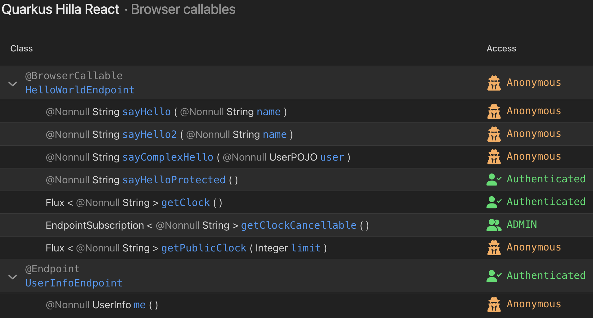

# ✨ Feature Details

This document keeps Quarkus-Hilla feature details out of the README. For historical setup notes and old workarounds, see [Quarkus-Hilla Legacy Notes](legacy-notes.md).

<a id="auto-crud-auto-grid-and-auto-form"></a>

## 🏗️ Auto CRUD, Auto Grid And Auto Form

Since: 24.4.1

The [Auto CRUD](https://vaadin.com/docs/latest/components/auto-crud), [Auto Grid](https://vaadin.com/docs/latest/components/auto-grid), and [Auto Form](https://vaadin.com/docs/latest/components/auto-crud) components are available in `quarkus-hilla-react`.

Quarkus-Hilla also provides custom `CrudRepositoryService` and `ListRepositoryService` implementations for Lit and React applications, based on:

- `quarkus-spring-data-jpa`
- `quarkus-hibernate-orm-panache`

Auto CRUD, Auto Grid, and Auto Form components are React-only. Repository services can also be used from Lit applications. See [CRUD & Repository Services](../../../wiki/Crud-List-repository-service) for more details.

<a id="endpoints-live-reload"></a>

## 🔄 Endpoints Live Reload

Since: 24.5

In dev mode, Quarkus-Hilla can regenerate client-side code when Hilla endpoint classes change. It watches either compiled class folders or Java source folders and triggers TypeScript client generation without a full rebuild.

Configuration example:

```properties
quarkus.live-reload.instrumentation=true
vaadin.hilla.live-reload.enable=true
vaadin.hilla.live-reload.watch-strategy=class
vaadin.hilla.live-reload.watched-paths=com/example/endpoints,com/example/services
```

Configuration options:

- `vaadin.hilla.live-reload.enable` enables endpoint client regeneration in dev mode. Default: `false`.
- `vaadin.hilla.live-reload.watch-strategy` watches `class` or `source`. Default: `class`.
- `vaadin.hilla.live-reload.watched-paths` restricts watched packages relative to source or class root.

`CLASS` works with Java and Kotlin and is more reliable with `quarkus.live-reload.instrumentation=true`. `SOURCE` currently supports Java source files only.

<a id="native-image-support"></a>

## 🚀 Native Image Support

Since: 24.5

Quarkus-Hilla supports GraalVM native image generation without known Quarkus-Hilla-specific limitations.

<a id="vaadin-quarkus-alignment"></a>

## 🔌 Vaadin Quarkus Alignment

Since: 24.5

Starting with 24.5, `quarkus-hilla` depends on the official [Vaadin Quarkus extension](https://github.com/vaadin/quarkus/). This reduces duplicated integration code and keeps Quarkus-Hilla closer to Vaadin's Quarkus runtime behavior.

<a id="custom-endpoint-prefix"></a>

## 🎯 Custom Endpoint Prefix

Since: 24.6

Configure a custom endpoint prefix with `vaadin.endpoint.prefix`:

```properties
vaadin.endpoint.prefix=/new-prefix
```

Quarkus-Hilla creates a custom `connect-client.ts` in the frontend folder and constructs `ConnectClient` with the configured prefix. If an existing `connect-client.ts` does not match the default Hilla template, it is not overwritten.

<a id="quarkus-dev-ui-integration"></a>

## 🖥️ Quarkus Dev UI Integration

Since: 24.7

Quarkus-Hilla provides a Dev UI page for endpoint inspection during development.

<picture>
  <source media="(prefers-color-scheme: dark)" srcset="../etc/dev-ui-dark.png">
  <source media="(prefers-color-scheme: light)" srcset="../etc/dev-ui-light.png">
  
</picture>

The page shows:

- Security constraints applied to server-side endpoints.
- Null-safety status for `@NonNull` types.
- Browser-callable endpoints with methods and parameters.

Run `mvn quarkus:dev`, then open `http://localhost:8080/q/dev-ui`.

<a id="mutiny-multi-support"></a>

## ⚡ Mutiny Multi Support

Since: 24.7

Hilla endpoints can return [Mutiny](https://smallrye.io/smallrye-mutiny/latest/) `Multi`. Quarkus-Hilla converts it to `Flux`, which is currently the reactive stream type supported by Hilla. `MutinyEndpointSubscription` can replace Hilla `EndpointSubscription` when an unsubscribe callback is needed.

```java
@BrowserCallable
@AnonymousAllowed
public class ClockService {

    public Multi<String> getClock() {
        return Multi.createFrom()
                .ticks()
                .startingAfter(Duration.ofSeconds(1))
                .every(Duration.ofSeconds(1))
                .onOverflow().drop()
                .map(unused -> LocalTime.now().toString())
                .onFailure()
                .recoverWithItem(err -> "Sorry, something failed...");
    }

    public MutinyEndpointSubscription<String> getCancellableClock() {
        return MutinyEndpointSubscription.of(getClock(), () -> {
            // unsubscribe callback
        });
    }
}
```

<a id="vaadin-copilot-integration"></a>

## 🧭 Vaadin Copilot Integration

Since: 25.1.2

Vaadin Copilot can inspect and edit Quarkus-Hilla applications in development mode. The integration maps Copilot's Spring-oriented backend hooks to Quarkus CDI and Vaadin Quarkus runtime APIs.

Supported data sources:

- Hilla `@BrowserCallable` and `@Endpoint` services from the Hilla `EndpointRegistry`.
- Flow UI services from Quarkus Arc bean discovery.
- Quarkus configuration properties.
- Vaadin route security status.
- Quarkus-Hilla version information.

Flow UI service discovery is conservative by default. It starts from application beans with service-like scopes and can be widened or narrowed with `vaadin.copilot.flow-services.*` configuration. See [Vaadin Copilot Integration](copilot-integration.md) for service discovery modes, filtering options, and implementation details.
